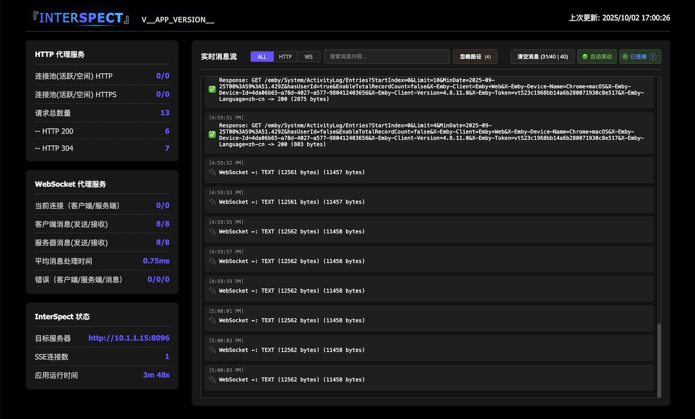
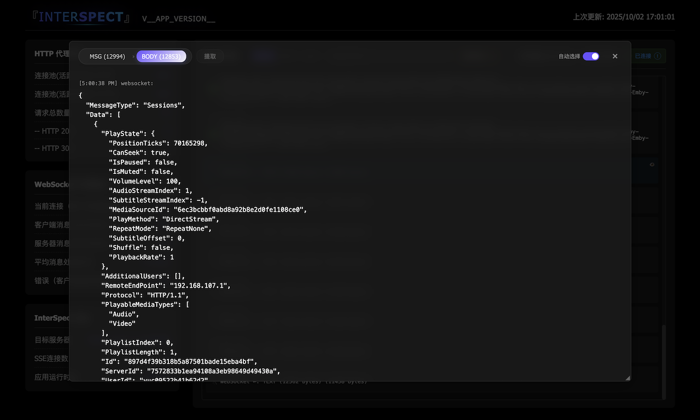

# Interspect

基于 NestJS 11.x 构建的 **API 交互协议分析工具**，通过透明代理的方式截取和监控 HTTP/HTTPS 请求与 WebSocket 消息，提供实时的协议分析和调试功能。

### 界面预览

#### 实时协议监控界面


#### 详细日志分析界面


## 核心功能

- 🔍 **协议截取** - 透明代理 HTTP/HTTPS 请求，完整记录请求头、参数、响应内容
- 📡 **消息监控** - 实时捕获 WebSocket 双向消息流，支持文本和二进制数据
- 📊 **性能分析** - 请求耗时、状态码分布、连接池状态等性能指标统计
- 📱 **实时仪表盘** - 基于 Server-Sent Events 的实时监控界面，支持日志过滤和分析
- 🗃️ **数据持久化** - 完整的请求/响应日志记录，支持压缩存储和回放

## 技术栈

- **框架**: NestJS 11.x
- **语言**: TypeScript 5.9.2
- **运行时**: Node.js
- **测试**: Jest
- **代码规范**: ESLint + Prettier
- **HTTP 代理**: http-proxy
- **WebSocket**: ws

## 快速开始

### 安装依赖

```bash
npm install
```

### 开发环境启动

```bash
# 带文件监听的开发模式
npm run start:dev

# 带调试模式的开发环境
npm run start:debug
```

### 生产构建和运行

```bash
# 构建项目
npm run build

# 生产环境运行
npm run start:prod
```

## 项目结构

```
src/
├── proxy-module/         # 代理服务核心
│   ├── services/         # HttpProxy 和 WebSocketGateway
│   └── proxy.module.ts   # 代理模块配置
├── inspect-module/       # 请求监控模块
│   ├── services/         # 日志、SSE 和指标服务
│   └── inspect.module.ts # 监控模块配置
├── common/              # 公共模块
│   ├── bootstrap/        # 应用启动初始化逻辑
│   ├── filters/          # 异常过滤器
│   └── utils/            # 工具类
├── app.module.ts        # 应用主模块
├── app.controller.ts    # 应用控制器
└── app.service.ts       # 应用服务
```

## 核心模块

### 代理服务 (Proxy Module)

- **HttpProxy**: 基于 http-proxy 库的 HTTP/HTTPS 代理实现
- **WebSocketGateway**: 基于 ws 库的 WebSocket 网关（一对一代理）
- **连接池管理**: 独立的 HTTP/HTTPS Agent，禁用连接复用避免 socket hang up
- **性能指标**: 实时收集请求统计和连接池指标

### 监控服务 (Inspect Module)

- **InspectService**: 完整的协议截取服务，支持 HTTP 请求/响应和 WebSocket 消息的详细记录
- **SseService**: Server-Sent Events 实时推送服务，带心跳检测和客户端管理
- **ProxyMetricsService**: HTTP 代理性能指标统计，包括请求量、状态码分布、响应时间等
- **AgentMetricsService**: 连接池状态监控，实时跟踪 sockets 数量和待处理请求

### Bootstrap 初始化

**common/bootstrap/** 目录包含应用启动时的初始化逻辑：
- **filters.setup.ts**: 全局异常过滤器配置
- **http-proxy.setup.ts**: HTTP 代理路由配置
- **websocket-proxy.setup.ts**: WebSocket 网关配置
- **static-assets.setup.ts**: 静态资源配置（`/interspect/web` 路径）

## 配置说明

### 环境变量

```bash
TARGET_SERVER_URL=http://localhost:3000  # 目标服务器 URL（必需配置）
PORT=3000                               # 服务端口（默认 3000）
```

### 代理配置

HTTP 代理支持以下配置：
- 超时时间: 120 秒
- 最大连接数: Infinity
- 最大空闲连接: 0
- 禁用连接复用 (避免 socket hang up)

### WebSocket 配置

- **透明代理**: 一对一双向消息代理，完整记录消息流向
- **数据类型**: 支持文本和二进制数据的截取与分析
- **连接管理**: 客户端断开时自动关闭对应的服务器连接
- **消息监控**: 通过 InspectService 记录时间戳、方向、内容等详细信息

## API 文档

### 代理端点

所有 HTTP 请求都会被代理到目标服务器：

```
GET /api/*     -> 代理到目标服务器
POST /api/*    -> 代理到目标服务器
PUT /api/*     -> 代理到目标服务器
DELETE /api/*  -> 代理到目标服务器
```

### 监控端点

```bash
GET  /metrics          # 获取性能指标
GET  /inspect/sse      # SSE 实时监控流
GET  /inspect/logs     # 获取请求日志
```

### WebSocket 连接

```bash
ws://localhost:3000/ws  # WebSocket 网关连接（一对一代理模式）
```

### 静态资源

```bash
GET  /interspect/web/  # 监控仪表盘界面
GET  /interspect/      # 重定向到 /interspect/web/
```

## 开发指南

### 代码规范

```bash
# ESLint 检查并修复
npm run lint

# Prettier 格式化
npm run format
```

### 测试

```bash
# 运行所有测试
npm test

# 监听模式
npm run test:watch

# 生成覆盖率报告
npm run test:cov

# E2E 测试
npm run test:e2e
```

## 监控仪表盘

访问 `http://localhost:3000/interspect/web/` 查看实时监控仪表盘，包括：

- 请求统计和性能指标
- 实时日志流
- WebSocket 连接状态
- 系统资源使用情况

### 主要功能

- **实时协议流**: 通过 Server-Sent Events 实时推送 HTTP 请求/响应和 WebSocket 消息
- **智能日志分析**: 支持按请求类型、状态码、时间范围等条件过滤和分析
- **性能可视化**: 实时图表显示请求量、响应时间、连接池状态等关键指标
- **双向消息追踪**: 清晰展示 WebSocket 消息的客户端到服务器、服务器到客户端流向
- **数据格式检测**: 自动识别并标注文本和二进制数据类型

## 构建和部署

### 构建流程

1. 编译 TypeScript 代码
2. 注入版本信息
3. 复制静态资源
4. 输出到 `dist/` 目录

### Docker 部署

```dockerfile
FROM node:18-alpine

WORKDIR /app

COPY package*.json ./
RUN npm ci --only=production

COPY . .
RUN npm run build

EXPOSE 3000

CMD ["npm", "run", "start:prod"]
```

## 使用场景

- **API 调试**: 在开发过程中截取和分析 API 请求/响应
- **协议分析**: 深入理解 WebSocket 通信协议和数据格式
- **性能监控**: 实时监控 API 响应时间和系统性能指标
- **故障排查**: 快速定位 API 调用失败和网络问题
- **学习研究**: 分析 HTTP 协议和 WebSocket 通信机制

## 贡献指南

1. Fork 项目
2. 创建特性分支 (`git checkout -b feature/AmazingFeature`)
3. 提交更改 (`git commit -m 'Add some AmazingFeature'`)
4. 推送到分支 (`git push origin feature/AmazingFeature`)
5. 创建 Pull Request

## 许可证

本项目采用 MIT 许可证。

## 联系方式

如有问题或建议，请提交 Issue 或 Pull Request。